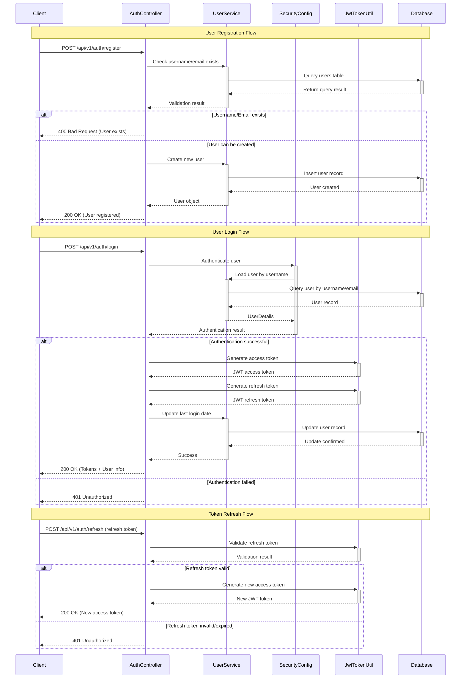
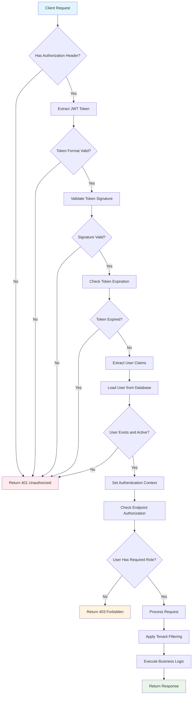
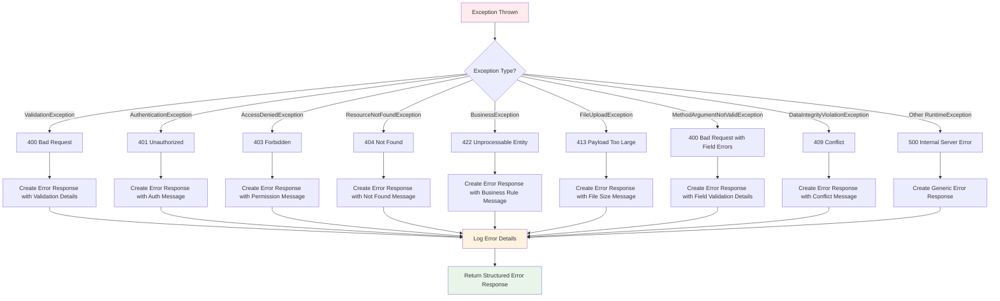
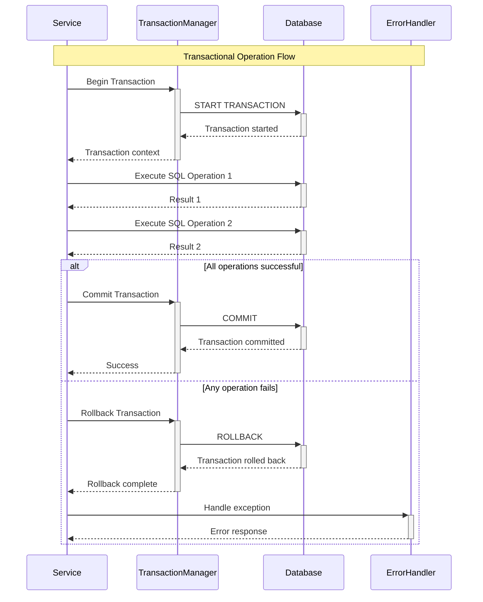
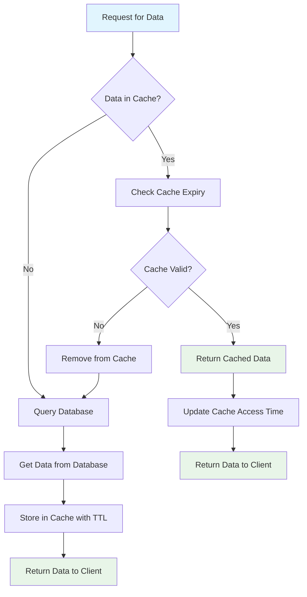
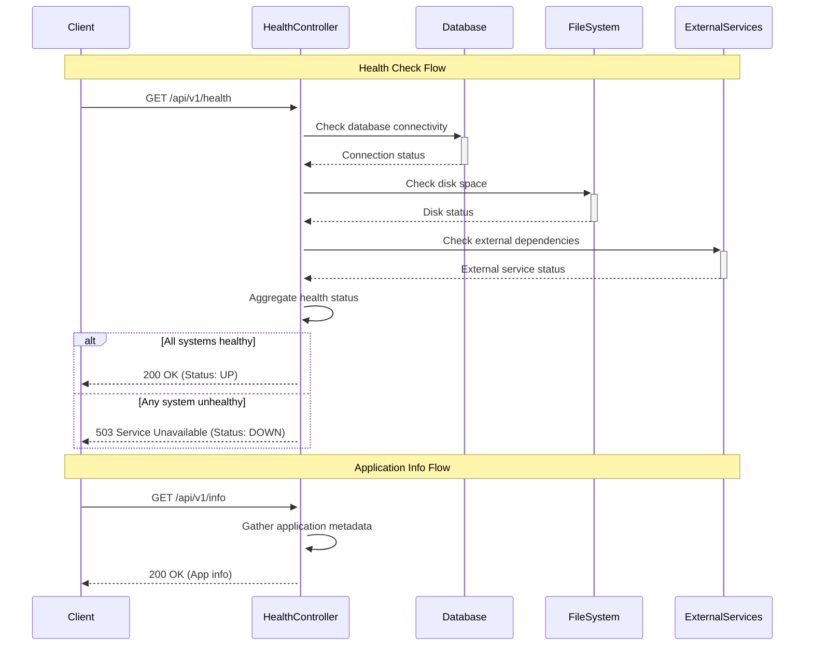
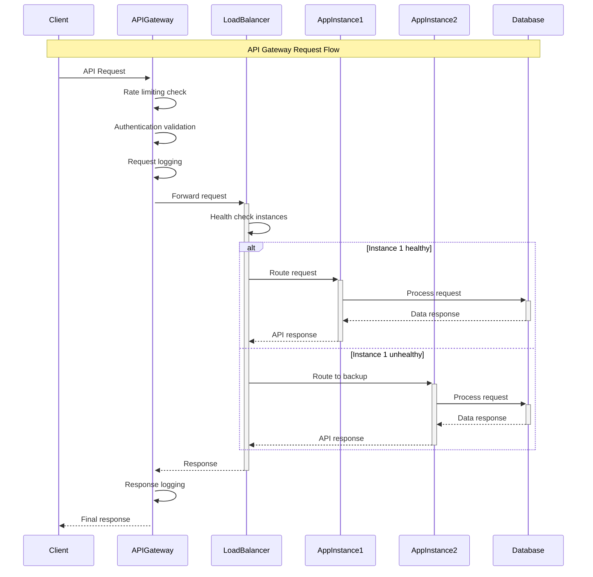
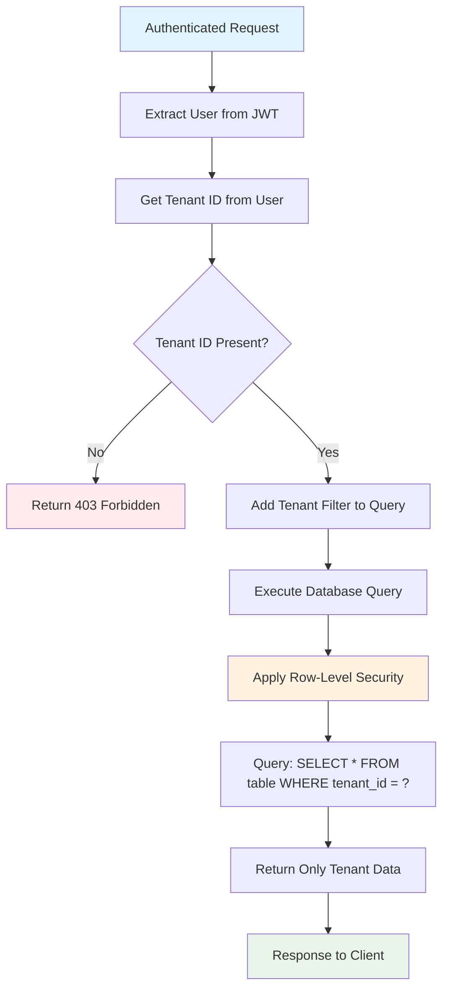

# Enterprise Document Search - Flow Diagrams

This document contains comprehensive Mermaid diagrams showing the various flows in the Enterprise Document Search application.

## 1. Authentication Flow



## 2. Document Management Flow

```mermaid
sequenceDiagram
    participant Client
    participant JwtFilter
    participant DocumentController
    participant DocumentService
    participant Database
    participant User

    Note over Client,Database: JWT Authentication Filter
    Client->>+JwtFilter: Request with Authorization header
    JwtFilter->>+JwtTokenUtil: Validate JWT token
    JwtTokenUtil-->>-JwtFilter: Token validation result
    
    alt Token valid
        JwtFilter->>+UserService: Load user from token
        UserService->>+Database: Query user by username
        Database-->>-UserService: User details
        UserService-->>-JwtFilter: User object
        JwtFilter->>DocumentController: Forward request with user context
    else Token invalid/expired
        JwtFilter-->>Client: 401 Unauthorized
    end

    Note over Client,Database: Get Documents Flow
    DocumentController->>+DocumentService: Get documents for tenant
    DocumentService->>+Database: Query documents by tenant_id
    Database-->>-DocumentService: Document list
    DocumentService-->>-DocumentController: Paginated documents
    DocumentController-->>Client: 200 OK (Documents list)

    Note over Client,Database: Create Document Flow
    Client->>+DocumentController: POST /api/v1/documents
    DocumentController->>User: Extract tenant_id from authenticated user
    DocumentController->>+DocumentService: Create document with tenant_id
    DocumentService->>+Database: Insert document record
    Database-->>-DocumentService: Created document
    DocumentService-->>-DocumentController: Document object
    DocumentController-->>Client: 200 OK (Created document)

    Note over Client,Database: Search Documents Flow
    Client->>+DocumentController: GET /api/v1/documents/search?query=term
    DocumentController->>User: Extract tenant_id
    DocumentController->>+DocumentService: Search documents by tenant and query
    DocumentService->>+Database: Execute search query (tenant filtered)
    Database-->>-DocumentService: Matching documents
    DocumentService-->>-DocumentController: Search results
    DocumentController-->>Client: 200 OK (Search results)

    Note over Client,Database: Update Document Flow
    Client->>+DocumentController: PUT /api/v1/documents/{id}
    DocumentController->>User: Extract tenant_id
    DocumentController->>+DocumentService: Update document if belongs to tenant
    DocumentService->>+Database: Update document where id=? AND tenant_id=?
    Database-->>-DocumentService: Update result
    
    alt Document found and updated
        DocumentService-->>-DocumentController: Updated document
        DocumentController-->>Client: 200 OK (Updated document)
    else Document not found/unauthorized
        DocumentService-->>-DocumentController: Not found
        DocumentController-->>Client: 404 Not Found
    end

    Note over Client,Database: Delete Document Flow
    Client->>+DocumentController: DELETE /api/v1/documents/{id}
    DocumentController->>User: Extract tenant_id
    DocumentController->>+DocumentService: Delete document if belongs to tenant
    DocumentService->>+Database: DELETE WHERE id=? AND tenant_id=?
    Database-->>-DocumentService: Deletion result
    
    alt Document found and deleted
        DocumentService-->>-DocumentController: Success
        DocumentController-->>Client: 204 No Content
    else Document not found/unauthorized
        DocumentService-->>-DocumentController: Not found
        DocumentController-->>Client: 404 Not Found
    end
```

## 3. File Upload and Processing Flow

```mermaid
sequenceDiagram
    participant Client
    participant FileUploadController
    participant FileProcessingService
    participant ApacheTika
    participant DocumentService
    participant Database

    Note over Client,Database: Single File Upload Flow
    Client->>+FileUploadController: POST /api/v1/upload/document (multipart file)
    FileUploadController->>User: Extract tenant_id from authenticated user
    
    FileUploadController->>+FileProcessingService: Process uploaded file
    FileProcessingService->>FileProcessingService: Validate file type and size
    
    alt File validation passes
        FileProcessingService->>+ApacheTika: Extract content from file
        ApacheTika-->>-FileProcessingService: Extracted text content
        FileProcessingService->>FileProcessingService: Create Document object with metadata
        FileProcessingService-->>-FileUploadController: Document object
        
        FileUploadController->>+DocumentService: Save document
        DocumentService->>+Database: Insert document with extracted content
        Database-->>-DocumentService: Saved document
        DocumentService-->>-FileUploadController: Document with ID
        
        FileUploadController-->>Client: 200 OK (Upload success + document info)
    else File validation fails
        FileProcessingService-->>-FileUploadController: Validation error
        FileUploadController-->>Client: 400 Bad Request (Validation error)
    end

    Note over Client,Database: Batch File Upload Flow
    Client->>+FileUploadController: POST /api/v1/upload/documents/batch (multiple files)
    FileUploadController->>FileUploadController: Initialize batch processing results
    
    loop For each uploaded file
        FileUploadController->>+FileProcessingService: Process individual file
        FileProcessingService->>FileProcessingService: Validate file
        
        alt File valid
            FileProcessingService->>+ApacheTika: Extract content
            ApacheTika-->>-FileProcessingService: Content
            FileProcessingService-->>-FileUploadController: Document object
            
            FileUploadController->>+DocumentService: Save document
            DocumentService->>+Database: Insert document
            Database-->>-DocumentService: Saved document
            DocumentService-->>-FileUploadController: Success
            
            FileUploadController->>FileUploadController: Add to success list
        else File invalid
            FileProcessingService-->>-FileUploadController: Error
            FileUploadController->>FileUploadController: Add to failed list
        end
    end
    
    FileUploadController-->>Client: 200 OK (Batch results: success/failed counts)

    Note over Client,Database: Supported File Types Query
    Client->>+FileUploadController: GET /api/v1/upload/supported-types
    FileUploadController->>+FileProcessingService: Get supported types info
    FileProcessingService-->>-FileUploadController: Supported types and limits
    FileUploadController-->>Client: 200 OK (Supported types info)
```

## 4. Security and Authorization Flow



## 5. Error Handling Flow



## 6. Database Transaction Flow



## 7. Caching Strategy Flow (Future Enhancement)



## 8. Monitoring and Health Check Flow



## 9. API Gateway Integration Flow (Future Enhancement)



## 10. Multi-Tenant Data Isolation Flow

